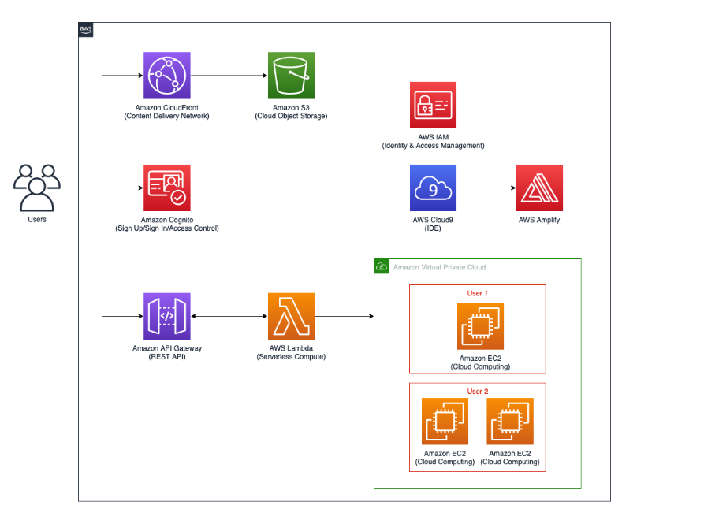

# Overview

As a technology professional with scripting experience and a new idea, you face the challenge of building a frontend for a proof of concept or minimum lovable product. Your team relies on you to provision Linux instances for their use. To streamline this process, you've already developed an AWS Lambda function that launches Elastic Compute Cloud (EC2) instances with appropriate tagging. But what if there was a more user-friendly approach that doesn't require accessing the AWS console?

In this scenario, you set out to create a serverless, full-stack single-page app with authentication capabilities. This app will empower users to easily launch and terminate EC2 instances. To achieve this, you'll delve into the features of the React library for building user interfaces. Then, you'll leverage AWS Amplify to seamlessly integrate AWS services with your frontend.

The integration involves adding authentication using Amazon Cognito and establishing a secure REST API through Amazon API Gateway. Furthermore, you'll enhance the backend by implementing a serverless function with AWS Lambda to interact with the Amazon EC2 service.

To complete the user experience, you'll utilize AWS Amplify once more to host your app. This hosting solution ensures efficient content delivery to end-users through the AWS content delivery network powered by Amazon CloudFront. All development activities will take place within the AWS Cloud9 integrated development environment (IDE).

## Objectives

By the end of this project, you will have achieved the following:

- Created and hosted a full-stack web app on AWS.
- Implemented React concepts such as states, effects, and props.
- Established authentication, API, function, and hosting resources on AWS using AWS Amplify.
- Successfully integrated your frontend with backend services.

## Architecture Overview

